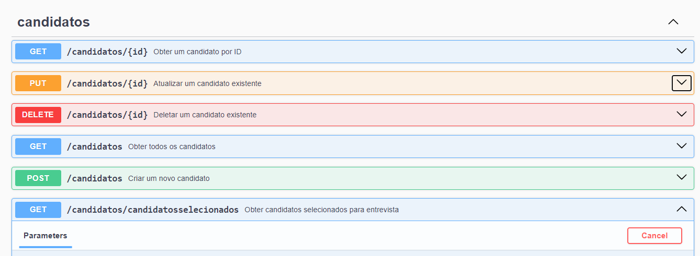

# Sistema Para Validação de Processo Seletivo

Esta API permite o gerenciamento de candidatos em um processo seletivo. As funcionalidades incluem a criação, leitura, atualização e exclusão de candidatos, bem como a seleção de candidatos para entrevistas com base em critérios específicos.

## Funcionalidades

**Swagger**


### Cria um novo Candidato

    Requsição: [POST] http://localhost:8080/candidatos

    Descrição: Cria um novo candidato se os parâmetros estiverem validos.

**Exemplo de Corpo da requisição**

```json
{
  "nome": "Tony Stark",
  "email": "tonystark@gmail.com",
  "telefone": "123456789",
  "experiencia": "Engenheiro de Software",
  "escolaridade": "Mestrado",
  "genero": "Masculino",
  "dataNascimento": "1975-06-15",
  "pretensaoSalarial": 7000
}
```
**Exemplo de resposta**
```json
{
  "id": 7,
  "nome": "Tony Stark",
  "email": "tonystark@gmail.com",
  "telefone": "123456789",
  "experiencia": "Engenheiro de Software",
  "escolaridade": "Mestrado",
  "genero": "Masculino",
  "dataNascimento": "1975-06-15",
  "pretensaoSalarial": 7000,
  "situacao": "LIGAR PARA O CANDIDATO"
}
```

### Obter Todos os Candidatos

    Requsição: [GET] http://localhost:8080/candidatos

    Descrição: Retorna uma lista de todos os candidatos cadastrados no sistema.

### Obter Candidato por ID

    Requsição: [GET] http://localhost:8080/candidatos/1

    Descrição: Retorna os detalhes de um candidato específico com base no ID fornecido.

### Obter Candidatos Selecionados para Entrevista

    Requsição: [GET] http://localhost:8080/candidatos/candidatosselecionados

    Descrição: Retorna uma lista de candidatos selecionados para entrevista com base na situação do candidato. A seleção é feita se a situação do candidato for "LIGAR PARA O CANDIDATO" ou "LIGAR PARA O CANDIDATO COM CONTRA PROPOSTA". Limita a seleção a no máximo 5 candidatos.

### Atualizar um Candidato Existente

    Requsição: [PUT] http://localhost:8080/candidatos/1

    Descrição: Atualiza as informações de um candidato existente com base no ID fornecido.

### Deletar um Candidato Existente

    Requsição: [DELETE] http://localhost:8080/candidatos/1

    Descrição: Deleta um candidato existente com base no ID fornecido.

## Configuração do Swagger

Para acessar a interface do Swagger UI e explorar a API de forma interativa, acesse:

    http://localhost:8080/swagger-ui/index.html

## Tecnologias Utilizadas

- Java
- Spring Boot
- Spring Data JPA
- PostreSQL


## Contribuição

Sinta-se à vontade para abrir issues e pull requests. Todos os tipos de contribuições são bem-vindos!
